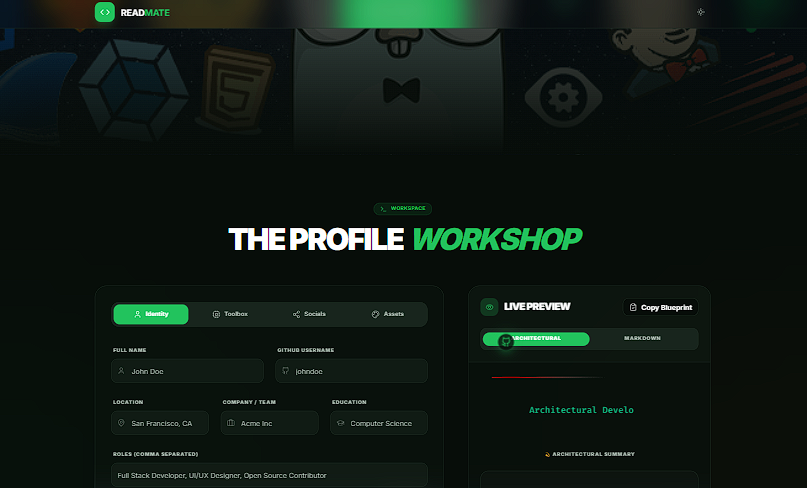

<!-- ===================================================== -->
<!-- 🖼 WEBSITE SCREENSHOT -->
<!-- ===================================================== -->

  

---

<!-- ===================================================== -->
<!-- 🌈 ANIMATED GRADIENT HERO -->
<!-- ===================================================== -->

  

---

<!-- ===================================================== -->
<!-- 🚀 STARTUP PITCH -->
<!-- ===================================================== -->

## 🚀 Startup Overview

<table width="100%" align="center">
<tr>
<td align="center">

GitHub Profile README Maker is a production-ready web application that enables developers to generate structured, recruiter-focused GitHub profile READMEs with live preview and one-click markdown export.

</td>
</tr>
</table>

---

<!-- ===================================================== -->
<!-- 📦 PRODUCT HUNT STYLE -->
<!-- ===================================================== -->

## 📦 Product Launch Summary

<table width="100%" align="center">
<tr>
<td align="center">

🚀 Generate stunning GitHub profile READMEs in seconds.  
No markdown stress. No formatting errors.  
Clean, professional, recruiter-ready output.

✔ Live Preview  
✔ Structured Sections  
✔ One-Click Copy  
✔ Modern UI  

</td>
</tr>
</table>

---

<!-- ===================================================== -->
<!-- 💎 SAAS POSITIONING -->
<!-- ===================================================== -->

## 💎 SaaS Vision

<table width="100%" align="center">
<tr>
<td align="center">

Future expansion opportunities:

• AI-powered bio suggestions  
• Resume & portfolio generator  
• Developer analytics dashboard  
• Premium themes & templates  

Target Users: Students, Job Seekers, Open-Source Developers, Indie Builders  

</td>
</tr>
</table>

---

<!-- ===================================================== -->
<!-- 🎨 CORE FEATURES -->
<!-- ===================================================== -->

## 🎨 Core Features

<table width="100%" align="center">
<tr>
<th align="center">Feature</th>
<th align="center">Benefit</th>
</tr>

<tr>
<td align="center">Live Markdown Rendering</td>
<td align="center">Instant preview experience</td>
</tr>

<tr>
<td align="center">Structured Section Builder</td>
<td align="center">Professional formatting</td>
</tr>

<tr>
<td align="center">One-Click Copy Export</td>
<td align="center">Seamless workflow</td>
</tr>

<tr>
<td align="center">Modern UI Design</td>
<td align="center">Strong first impression</td>
</tr>

</table>

---

<!-- ===================================================== -->
<!-- 📊 GITHUB ANALYTICS -->
<!-- ===================================================== -->

## 📊 GitHub Analytics

<table width="100%" align="center">
<tr>
<td align="center">

</td>
<td align="center">

</td>
</tr>
<tr>
<td colspan="2" align="center">

</td>
</tr>
</table>

---

<!-- ===================================================== -->
<!-- 🎯 RECRUITER SECTION -->
<!-- ===================================================== -->

## 🎯 Recruiter Insight

<table width="100%" align="center">
<tr>
<td align="center">

This project demonstrates:

• Frontend architecture expertise  
• UI/UX design capability  
• Clean code practices  
• Production deployment knowledge  
• Developer branding awareness  

</td>
</tr>
</table>

---

<!-- ===================================================== -->
<!-- 🌈 FOOTER -->
<!-- ===================================================== -->

  

  ⭐ Star the repository if you find it useful  
   
  Built for Modern Developer Branding 🚀

